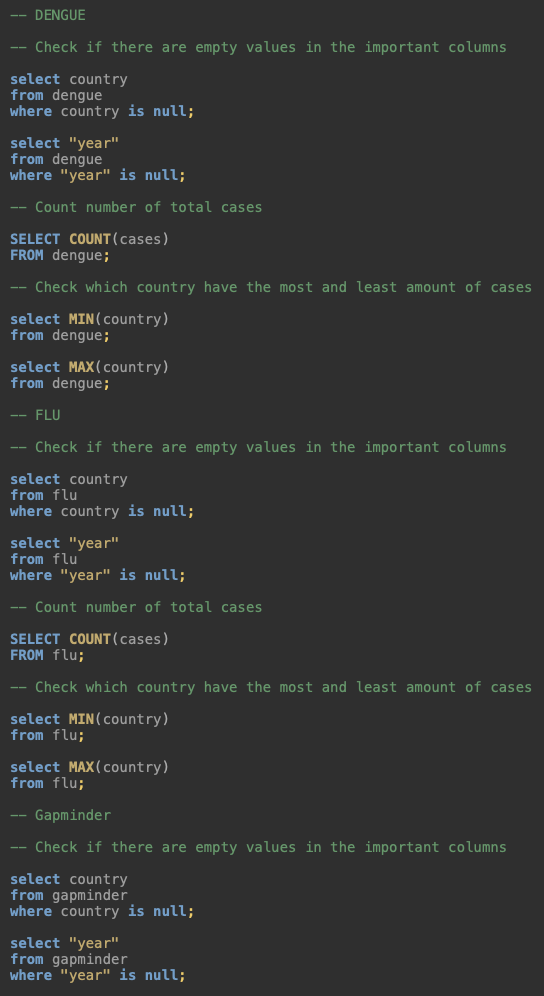
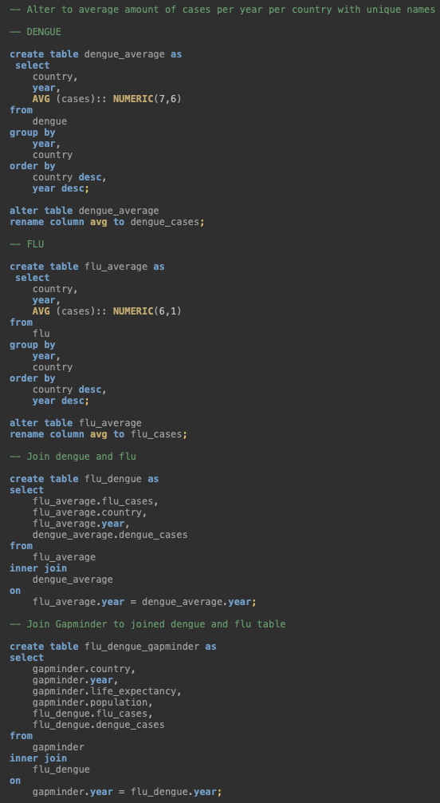

# Relational data and databases (7) {-}

## Introduction {-}

This assignment was focused on learning the basics of the SQL language and how to work this around relational data and databases. These are collections of information stored in separate tables with underlying relations to create an easy overview of relations between different data structures.

Starting by creating three data frames out of files and making them tidy.

```{r libraries}

library(dslabs)
library(tidyverse)
library(DBI)
library(dplyr)
library(ggplot2)

```

```{r import and tidy}

# The flu
## Import, first 11 lines are metadata
flu_df <- read_csv("files/flu_data.csv", skip = 11)
## Make tidy
flu_df_tidy <- flu_df %>% pivot_longer(cols = c(2:ncol(flu_df)), names_to = 'country', values_to = 'cases') %>% na.omit()

# Dengue
## Import, first 11 lines are metadata
dengue_df <- read_csv("files/dengue_data.csv", skip = 11)
## Make tidy
dengue_df_tidy <- dengue_df %>% pivot_longer(cols = c(2:ncol(dengue_df)), names_to = 'country', values_to = 'cases') %>% na.omit()

# Gapminder
## The dataframe is part of the dslabs package and therefore does not need to be imported.
## The dataframe is already tidy.

```

An important part of relational data is enabling comparison across different data frames. In this case we will be looking at the country and date, but in the data frames we use there are a couple of things that needs to be adjusted to make them similar.

```{r adjusting}

# Column 'country'
## Check types.
class(flu_df_tidy$country) # Character
class(dengue_df_tidy$country) # Character
class(gapminder$country) # Factor

## Change all types into factor
flu_df_tidy$country <- as.factor(flu_df_tidy$country)
dengue_df_tidy$country <- as.factor(dengue_df_tidy$country)

## Check if it worked
class(flu_df_tidy$country) # Factor
class(dengue_df_tidy$country) # Factor
## It worked!

# Column 'date'
## Check types.
class(flu_df_tidy$Date) # Date
class(dengue_df_tidy$Date) # Date
class(gapminder$year) # Integer

## Because flu and dengue are specified to day instead of the year at gapminder, a 'year' column needs to be added and changed into the integer type to create similarity.
flu_df_tidy <- flu_df_tidy %>% mutate(year = substr(flu_df_tidy$Date, start=1, stop=4))
dengue_df_tidy <- dengue_df_tidy %>% mutate(year = substr(dengue_df_tidy$Date, start=1, stop=4))

flu_df_tidy$year <- as.integer(flu_df_tidy$year)
dengue_df_tidy$year <- as.integer(dengue_df_tidy$year)

## Check if it worked.
class(flu_df_tidy$year) # Integer
class(dengue_df_tidy$year) # Integer
## It worked!

```

The data frames are now similar and can be stored into csv and rds files.

```{r export}

# Export data frames as csv
write.csv(flu_df_tidy, "files/flu.csv", row.names=FALSE)
write.csv(dengue_df_tidy, "files/dengue.csv", row.names=FALSE)
write.csv(gapminder, "files/gapminder.csv", row.names=FALSE)

# Export data frames as rds
saveRDS(flu_df_tidy, file="files/flu.rds")
saveRDS(dengue_df_tidy, file="files/dengue.rds")
saveRDS(gapminder, file="files/gapminder.rds")

```

DBeaver and R were connected (my real password is hidden) and the tables were inserted into the 'workflowsdb' database in DBeaver for inspection.

```{r connecting DBeaver, eval = FALSE}
con <- dbConnect(RPostgres::Postgres(), 
                 dbname = "workflowsdb", 
                 host="localhost", 
                 port="5432", 
                 user="postgres", 
                 password="Marlie99.")

```

```{r insert in DBeaver, eval = FALSE}
dbWriteTable(con, "gapminder", gapminder)
dbWriteTable(con, "flu", flu_df_tidy)
dbWriteTable(con, "dengue", dengue_df_tidy)
```

Now that the tables are imported, i checked a couple of things.
Dengue has no "NULL" variables in country and year, 6263 cases in the data set and the average amount of cases is 0.14 with a standard deviation of 0.14. The country with the least amount of cases is Argentina with 0 cases and the country with the most is Venezuela with 1 case.
The flu has no "NULL variables in country and year, 17266 cases in the data set and the average amount of cases is 473.74 with a standard deviation of 768.95. The country with the least amount of cases is Argentina with 0 cases and the country with the most is Uruguay 10555 cases.

Gapminder had no "NULL" variables in country and year.

What stood out to me in general was that the dataset missed an important thing. The cases columns didn't specify how it was mesured, so a lot of metadata missed. This resulted in unreliable data .

The information is obtained by the following SQL and R code:
   


Figure 2: SQL code of data inspection.   

For a good analysis of the different, but related data, they need to be joined together in one table with the important columns.


     
Figure 3: SQL code of inner-join.
   
```{r data inspection}

# Dengue

min(dengue_df_tidy$cases) # 0
max(dengue_df_tidy$cases) # 1
mean(dengue_df_tidy$cases) # 0.14
sd(dengue_df_tidy$cases) # 0.14

# Flu

min(flu_df_tidy$cases) # 0
max(flu_df_tidy$cases) # 10555
mean(flu_df_tidy$cases) # 473.74
sd(flu_df_tidy$cases) # 768.95

# Load joined table to object
gapminder_flu <- read_csv("files/gapminder_flu.csv")
flu_dengue <- read_csv("files/flu_dengue.csv")

```

The analysis is done by descriptive statistics. First is the Shapiro-wilk to check for normal data, this was ... the case. The next step is an ANOVA, because we deal with 3 sets, this lead to ... . Finally the post-hoc tests, which concluded that ... .

```{r despriptive statistics}


```

A good analysis contains graphs to bring things in vision.

```{r visualisation}

gapminder_flu %>%
  ggplot(aes(x=continent,y=flu_cases, group=continent, fill=continent)) + 
  geom_col(stat="identity")+ 
  labs(title = "Flu cases per continent", 
       x="Continent", 
       y="Average flu cases per continent",
       caption = "Figure 3: Bargraph of the amount of flu cases per continent") +
  theme(legend.position = "right", text = element_text(size=10))

ggplot(flu_dengue, aes(x=year, y=flu_cases, group = country, color = country)) + 
  geom_point() +
  geom_line() +
  labs(title = "Flu cases",
       x = "Year",
       y = "Average dengue cases per year",
       caption = "Figure 4: Linegraph of average flu cases per year per country.") +
  theme(legend.position = "right", text = element_text(size=10))

ggplot(flu_dengue, aes(x=year, y=dengue_cases, group = country, color = country)) + 
  geom_point() +
  geom_line() +
  labs(title = "Dengue cases",
       x = "Year",
       y = "Average dengue cases per year",
       caption = "Figure 5: Linegraph of average dengue cases per year per country.") +
  theme(legend.position = "right", text = element_text(size=10))

```

- Descriptive statistics
- 3 visualisations

Plan:
V load data, prepare data 
plot using bargraph or boxplot
check normality (Shapio-Wilk) of both groups separately
perform ANOVA
if significant, perform post hoc tests
