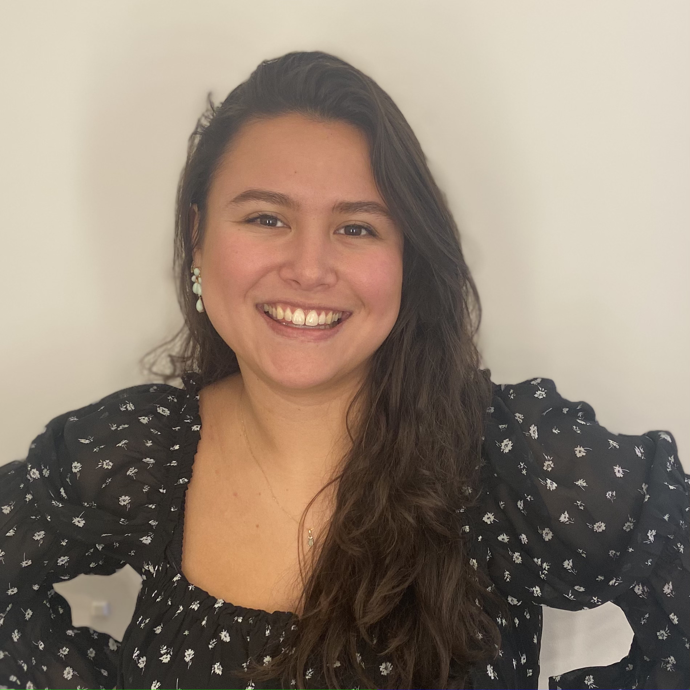

```{r include=FALSE}
# Automatically create a bib database for R packages
knitr::write_bib(c(
  .packages(), 'bookdown', 'knitr', 'rmarkdown'
), 'packages.bib')

# Exclude messages
knitr::opts_chunk$set(message = FALSE, warning = FALSE)
```

```{r libraries, echo = FALSE}

library(readxl)
library(tidyverse)
library(kableExtra)
library(adegenet)
library(Biostrings)
library(msa)
library(ape)
library(ggtree)
library(rentrez)
library(copopa)
library(dslabs)
library(DBI)
library(dplyr)
library(ggplot2)
library(car)
library(FSA)
library(utils)
library(dplyr)
library(data.table)
library(writexl)
library(httr)
library(ggrepel)
library(scales)

```

# Curriculum Vitae {-}



----

## Contact information {-}

<i class="fa fa-home"></i> Utrecht, The Netherlands<br>

<i class="fa fa-envelope"></i> cocojn@hotmail.com

<i class="fa fa-phone"></i> +31 6 48 48 34 68

<i class="fa fa-github"></i> [github.com/coconiemel](https://github.com/coconiemel)

----

## Education {-}

__Biology and medical labratory research, University of applied sciences__ 

Utrecht

2019 - today

- _Minor in Data science for biology._

- _Propaedeutic phase completed._

__Physical therapy, University of applied sciences__

Utrecht

2017 - 2019

----

## Professional Experience {-}

__Pracht jewelry store__

Seller and Fashion advisor

Utrecht

2022 - today

- _Sell different types of jewelry._

- _Give advise._

- _Compose wedding or event  jewelry sets._

__Saltro, COVID-19 pandemic laboratory__

Medical microbiology analist

Utrecht

2021

- _Checking incoming samples._

- _Analyze samples for COVID-19._

- _Return results to GGD._ 

__The Sales Unit__

Teamcaptain

Utrecht

2019 - 2021

- _Recruit donors for charities._

- _Responsibility for a team of 4/5 people._

- _Provide weekly salestraining._

__Restaurant Het Kabinet__ 

Bartender

The Hague

2017 - 2019

__Albert Heijn__ 

Cashier

The Hague

2016 - 2017

__Pet shop Renee van der Westen__ 

Seller

The Hague

2015

----

## Skills {-}

R, Bash

Adobe Photoshop, Adobe Premiere Pro

----

## Languages {-}

Dutch, native speaker

English, C1

Spanish, B1
