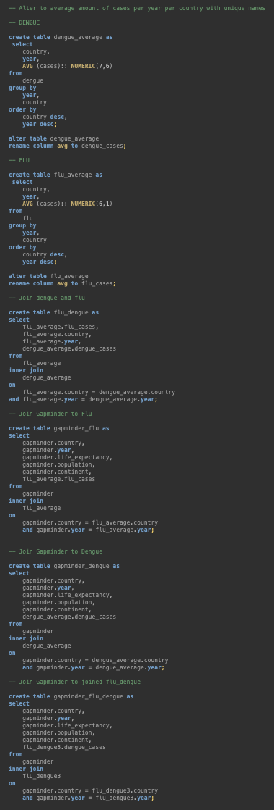
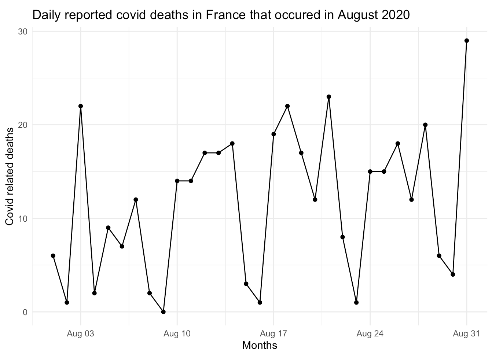

```{r include=FALSE}
# automatically create a bib database for R packages
knitr::write_bib(c(
  .packages(), 'bookdown', 'knitr', 'rmarkdown'
), 'packages.bib')
knitr::opts_chunk$set(message = FALSE, warning = FALSE)
```

```{r libraries, echo = FALSE}

library(readxl)
library(tidyverse)
library(kableExtra)
library(adegenet)
library(Biostrings)
library(msa)
library(ape)
library(ggtree)
library(rentrez)
library(copopa)
library(dslabs)
library(DBI)
library(dplyr)
library(ggplot2)
library(car)
library(FSA)
library(utils)
library(dplyr)
library(data.table)
library(writexl)
library(httr)
library(ggrepel)
library(scales)

```

# Curriculum Vitae {-}


----

## Contact information {-}

<i class="fa fa-home"></i> Utrecht, The Netherlands<br>

<i class="fa fa-envelope"></i> cocojn@hotmail.com

<i class="fa fa-phone"></i> +31 6 48 48 34 68

<i class="fa fa-github"></i> [github.com/coconiemel](https://github.com/coconiemel)

----

## Education {-}

__Biology and medical labratory research, University of applied sciences__ 

Utrecht

2019 - today

- _Minor in Data science for biology._

- _Propaedeutic phase completed._

__Physical therapy, University of applied sciences__

Utrecht

2017 - 2019

----

## Professional Experience {-}

__Pracht jewelry store__

Seller and Fashion advisor

Utrecht

2022 - today

- _Sell different types of jewelry._

- _Give advise._

- _Compose wedding or event  jewelry sets._

__Saltro, COVID-19 pandemic laboratory__

Medical microbiology analist

Utrecht

2021

- _Checking incoming samples._

- _Analyze samples for COVID-19._

- _Return results to GGD._ 

__The Sales Unit__

Teamcaptain

Utrecht

2019 - 2021

- _Recruit donors for charities._

- _Responsibility for a team of 4/5 people._

- _Provide weekly salestraining._

__Restaurant Het Kabinet__ 

Bartender

The Hague

2017 - 2019

__Albert Heijn__ 

Cashier

The Hague

2016 - 2017

__Pet shop Renee van der Westen__ 

Seller

The Hague

2015

----

## Skills {-}

R, Bash

Adobe Photoshop, Adobe Premiere Pro

----

## Languages {-}

Dutch, native speaker

English, C1

Spanish, B1

<!--chapter:end:index.Rmd-->

# Reproducible Research {-}

## Introduction {-}

During this assignment I learned to search, analyse and use different types of reproducible data.

## Analyse an excel file {-}

The experiment used for this analysis was obtained from an experiment in which adult C. elegans was exposed to varying concentrations of different compounds. The data for this experiment is supplied by J. Louter (INT/ILC).

The experiment contains a Excel file called CE.LIQ.FLOW.062_Tidydata.xlsx. During analysing this file I noticed that under 'compVehicle' the negative and positive seems to be alike, apart from the concentration. Negative is a higher concentration with ethanol and positive is a lower concentration with a variation of things. 
The summary of the file tells the positive control is ethanol and the negative control is S medium.

```{r opening and importing}

# Obtain file in environment
CE.LIQ.FLOW.062 <- read_excel("files/CE.LIQ.FLOW.062_Tidydata.xlsx") 

```

After import in R I checked the datatypes, but these were not assigned correctly. 
RawData is double, but should be integer, because it contains full numbers.
CompName is character, but should be factor, because the names can be changed with numbers and get sorted by.
CompConcentration is character, bu should be double, because it contains decimals.

To keep working with the file, I changed the datatypes to the correct ones. 

```{r alter type}

# Turn into integer datatype.
CE.LIQ.FLOW.062$RawData <- as.integer(CE.LIQ.FLOW.062$RawData)

# Turn into factor.
CE.LIQ.FLOW.062$compName <- as.factor(CE.LIQ.FLOW.062$compName)

# Turn into double (numeric value).
CE.LIQ.FLOW.062$compConcentration <- as.double(CE.LIQ.FLOW.062$compConcentration)

```

After this plotting was possible. The scatterplot shows the log10 of the concentration of different compounds in the C. elegans offspring count. 
The correction with log10 was necessary because the labels of the x-axis were overlapping each other, the values had a large number of decimals and were randomly positioned. 

```{r create plot}

# Obtain needed columns
CE.LIQ.FLOW.062_summary <- CE.LIQ.FLOW.062 %>% 
  group_by(compName, compConcentration, expType) %>%                          
                                 summarize(mean_counts = mean(RawData, na.rm = TRUE),
                                             sd_counts =  sd(RawData, na.rm = TRUE),)
CE.LIQ.FLOW.062_summary_tbl <- CE.LIQ.FLOW.062_summary %>% 
  filter(expType == "experiment")

# Create scatterplot
CE.LIQ.FLOW.062_summary_tbl %>% ggplot(aes(x = log10(compConcentration), 
                                           y = mean_counts)) +
  geom_point(aes(color = compName, shape = expType), size = 2, 
position = position_jitter(width = 0.5, height = 0.5, seed = 123)) +
  geom_errorbar(aes(ymin=mean_counts-sd_counts, ymax=mean_counts+sd_counts, 
                    color = compName), width= 0.2, 
                position = position_jitter(width = 0.5, height = 0.5, seed = 123))+
  labs(title = "Mean counts C. elegans offspring in various concentrations",
       x = "Log10 of compound concentration",
       y = "C. elegans offspring count") +
  theme(axis.text = element_text(size = 10)) 

```

For further analysing of the effect I would start by testing normality by performing a Shapiro-Wilk test. If unusual, I would normalize the data, if normal, I would start an ANOVA between de different conditions. I would end with the post-hoc tests, to check in what combination of groups the difference is.

In this case, the data is not normal, so normalizing is necessary.
The normalizing step is to see if the offspring count increases or decreases relatively to the negative control and if so, if there is anything influenced by the negative control.

```{r normalize data}

# Viewing CE.LIQ.FLOW.062_summary shows the mean value of controlNegative = 85.9.

# Add the column with normalized average counts
CE.LIQ.FLOW.062_summary_norm <- CE.LIQ.FLOW.062_summary_tbl %>% 
  mutate(norm_counts = mean_counts/85.9, norm_sd = sd_counts/85.9)

# Create scatterplot with normalized data
CE.LIQ.FLOW.062_summary_norm %>% ggplot(aes(x = log10(compConcentration), 
                                            y = norm_counts)) +
  geom_point(aes(color = compName, shape = expType), size = 2, 
position = position_jitter(width = 0.5, height = 0.5, seed = 150)) +
  geom_errorbar(aes(ymin=norm_counts-norm_sd, ymax=norm_counts+norm_sd, 
                    color = compName), width= 0.2, 
                position = position_jitter(width = 0.5, height = 0.5, seed = 150))+
  labs(title = "Mean counts C. elegans offspring in various concentrations",
       subtitle = "Normalized to negative control = 1",
       x = "Log10 of compound concentration",
       y = "C. elegans offspring count") +
  theme(axis.text = element_text(size = 10)) 

```

## Scoring reproducibility {-}

The next analysis is based on an article that addresses if meaningless novel words in linguistic contexts can achieve emotional connotations and whether these connotations can affect the quality of word learning and retention [@snefjellaHowEmotionLearned2020].

There is a lot of language research concerning the human capacity for learning new words, though this research is by far not complete yet. Because of that, the goal of this paper is to add to this research field.

To answer these questions, five experiments were set up. three groups of L1 speakers of the English language had to learn nine novel words in a consistently positive, neutral or negative context. During the learning phase, reading times were recorded. Immediately after and one week after, vocabulary post-test were administered to assess learning and retention.

The results showed that for both research questions two out of three groups learned the forms, definitional meanings en emotional connotations and that de positive group learned the best out of the three groups.

The analysis is a scoring on the basis of the [Repita transparency criteria](https://www.researchgate.net/publication/340244621_Reproducibility_and_reporting_practices_in_COVID-19_preprint_manuscripts). This is a method for identifying reproducibility issues in a scientific publication [@sumnerReproducibilityReportingPractices2020]. The scoring is shown below, the definitions can be found in the link above.

```{r repita scoring table}

# Create matrix
repita_criteria_tab <- matrix(c("Study purpose", "V", "Data availability statement", "V", "Data location", "[Available here](https://osf.io/yghx3/)", "Study location", "USA", "Author review", "[Bottom of page](https://www.sciencedirect.com/science/article/abs/pii/S0749596X20300851?via%3Dihub)", "Ethics statement", "V", "Funding statement", "V", "Code availability", "X"), ncol=2, byrow=TRUE)

# Define names of matrix
colnames(repita_criteria_tab) <- c('Transparency criteria', 'Score')

# Convert matrix to table 
repita_criteria_tab <- as.table(repita_criteria_tab)

# Design and view table 
kable(repita_criteria_tab) %>%
  kable_styling(latex_options = "striped")

```

## Usage of other peoples codes {-}

The last analysis contains a code of an article about the case-fatality rate of COVID-19  [@dudelMonitoringTrendsDifferences2020].

Looking at the code, is seems to achieve a visualisation of the differences in case-fatality rate (CFR)  over time in between countries, using the age structure of infection and age specific CFRs. This is done by creating tables containing the latest data of diagnosed cases and death counts (concerning COVID-19) for each country.

The readability of the code is quite al right. The code in general is readable and understandable because of comments en different chuncks. But the total code is quite long and stored in different files, which makes it a little bit harder to access and run.

After trying the code myself the code was a little less accessible than I thought. At first it took a lot of effort, because the file in the url didn't exist any more and I couldn't figure out the updated pathway. The updated pathway was not clearly indicated, but once I found it the reproduction was pretty smooth and I only had to make small changes.

<details><summary>The full code is stated below, showing comments of changes i made to make it run smoothly.</summary>

```{r functions}

### Case fatality rate #######################################################

  # cc = case-age distribution
  # rr = age-specific case fatality rates
  cfr <- function(cc,rr){
    sum(cc * rr)
  }

  
### Kitagawa decomposition ####################################################

  # c1 = Age distribution population 1
  # r1 = Case fatality rates population 1
  # c2 = Age distribution population 2
  # r2 = Case fatality rates population 2
  
  kitagawa_cfr <- function(c1, r1, c2, r2){
    
    # Calculate age-distribution of cases
    c1  <- c1 / sum(c1)
    c2  <- c2 / sum(c2)
    
    # Total difference
    Tot <- cfr(c1, r1) - cfr(c2, r2)
    
    # Age component
    Aa  <- sum((c1 - c2) * (r1 + r2) / 2)
    
    # Case fatality component
    Bb  <- sum((r1 - r2) * (c1 + c2) / 2)
    
    # Output
    list(Diff = Tot, 
         AgeComp = Aa,
         RateComp = Bb, 
         CFR1 = weighted.mean(r1,c1), 
         CFR2 = weighted.mean(r2,c2))
  }
```

```{r non existing input, eval = FALSE}
## This whole chunck doesn't work anymore because the file in the url has been deleted by the owner. Instead of this file, a file in the given data, named "inputdata.csv", will be used. Because of this, the chunck will not be executed (eval = false).

  # Required packages
 source(("00_functions.R"))

  # URL + filename
  url <- 'https://osf.io/wu5ve//?action=download'
  filename <- 'Data/Output_10.csv'
  
  # Load data
  GET(url, write_disk(filename, overwrite = TRUE))
  dat <- read_csv(filename,skip=3)

  
### Edit data (select countries, etc.) ########################################
  
  # Lists of countries and regions
  countrylist <- c("China","Germany","Italy","South Korea","Spain","USA")
  region <- c("All","NYC")
  
  # Restrict
  dat <- dat %>% filter(Country %in% countrylist & Region %in% region)
  
  # Remove Tests variable
  dat <- dat %>% mutate(Tests=NULL)
  
  # Drop if no cases/Deaths
  dat <- na.omit(dat)
  
  
### Save ######################################################################
  
  write_csv(dat,path="Data/inputdata.csv")
```

```{r COVID CFR analysis, eval = FALSE}
### Load functions & packages #################################################

# Not necessary anymore, all the libraries are stored together above.
 ## source(("00_functions.R")) 


### Load and edit data ########################################################

  # Load CSV file
  dat <- read_csv("files/COVID_article/inputdata.csv")
  
  # Set Date as date
  dat$Date <- as.Date(dat$Date,"%d.%m.%y")

  # Find max dates
  maxdates <- dat %>% 
    group_by(Country,Region) %>% 
    summarize(maxdate=max(Date))
  
  # Get least common denominator
  maxdate <- maxdates %>% 
    filter(Country!="China") %>% 
    ungroup() %>% 
    summarize(min(maxdate))
  
  # As vector
  maxdate <- as.data.frame(maxdate)[1,1]


### Numbers for Table 1 #######################################################
  
  # Latest date: maxdate
  refdate <- as.Date("30.06.2020","%d.%m.%Y")
  dat2 <- dat  %>% filter(Date<=refdate) #maxdate
  
  # Aggregate case and death counts
  cases <- aggregate(Cases~Code+Date+Country+Region,data=dat2[dat2$Sex=="b",],sum) 
  deaths <- aggregate(Deaths~Code+Date+Country+Region,data=dat2[dat2$Sex=="b",],sum)
  
  # Most recent counts
  cases %>% group_by(Country,Region) %>% dplyr::slice(which.max(Date))
  deaths %>% group_by(Country,Region) %>% dplyr::slice(which.max(Date))
  
  
### Analysis for Table 2 (and appendix) #######################################
  
  # Calculate ASFRs
  dat <- dat %>% mutate(ascfr = Deaths / Cases,
                        ascfr = replace_na(ascfr, 0))
  
  # Get codes for reference countries
  maxdate <- format.Date(maxdate,"%d.%m.%Y")
  refdate <- as.Date("30.06.2020","%d.%m.%Y")
  refdate2 <- format.Date(refdate,"%d.%m.%Y")#maxdate
  
  DE_code <- paste0("DE_",refdate2)#paste0("DE_",maxdate)
  IT_code <- paste0("ITbol",refdate2)#paste0("ITinfo",maxdate)
  SK_code <- paste0("KR",refdate2)#paste0("SK",maxdate)
  
  # Decide some reference patterns (For main text: SK)
  DE <- dat %>% 
    filter(Code == DE_code,
           Sex == "b")
  IT <- dat %>% 
    filter(Code == IT_code,
           Sex == "b")
  SK <- dat %>% 
    filter(Code == SK_code,
           Sex == "b")
  
  # Decompose
  DecDE <- as.data.table(dat)[,
                              kitagawa_cfr(DE$Cases, DE$ascfr,Cases,ascfr),
                              by=list(Country, Code, Date, Sex, Region)]
  
  DecIT <- as.data.table(dat)[,
                              kitagawa_cfr(IT$Cases, IT$ascfr,Cases,ascfr),
                              by=list(Country, Code, Date, Sex,Region)]
  
  DecSK <- as.data.table(dat)[,
                              kitagawa_cfr(SK$Cases, SK$ascfr,Cases,ascfr),
                              by=list(Country, Code, Date, Sex,Region)]
  
  # Select only most recent date, both genders combined
  
  DecDE <- DecDE %>% filter(Sex=="b") %>% group_by(Country,Region) %>% filter(Date<=refdate) %>% dplyr::slice(which.max(Date))
  DecIT <- DecIT %>% filter(Sex=="b") %>% group_by(Country,Region) %>% filter(Date<=refdate) %>% dplyr::slice(which.max(Date))
  DecSK <- DecSK %>% filter(Sex=="b") %>% group_by(Country,Region) %>% filter(Date<=refdate) %>% dplyr::slice(which.max(Date))
  
  # Drop unnecessary variables
  DecDE <- DecDE %>% select(Country,Region,Date,CFR2,Diff,AgeComp,RateComp)
  DecIT <- DecIT %>% select(Country,Region,Date,CFR2,Diff,AgeComp,RateComp)
  DecSK <- DecSK %>% select(Country,Region,Date,CFR2,Diff,AgeComp,RateComp)
  
  # Calculate relative contributions
  DecDE <- DecDE %>% mutate(relAgeDE = abs(AgeComp)/(abs(AgeComp)+abs(RateComp)))
  DecDE <- DecDE %>% mutate(relRateDE = abs(RateComp)/(abs(AgeComp)+abs(RateComp)))
  
  DecIT <- DecIT %>% mutate(relAgeIT = abs(AgeComp)/(abs(AgeComp)+abs(RateComp)))
  DecIT <- DecIT %>% mutate(relRateIT = abs(RateComp)/(abs(AgeComp)+abs(RateComp)))
  
  DecSK <- DecSK %>% mutate(relAgeSK = abs(AgeComp)/(abs(AgeComp)+abs(RateComp)))
  DecSK <- DecSK %>% mutate(relRateSK = abs(RateComp)/(abs(AgeComp)+abs(RateComp)))
  
  # Rename
  DecDE <- DecDE %>% rename(DiffDE=Diff,AgeCompDE=AgeComp,RateCompDE=RateComp)
  DecIT <- DecIT %>% rename(DiffIT=Diff,AgeCompIT=AgeComp,RateCompIT=RateComp)
  DecSK <- DecSK %>% rename(DiffSK=Diff,AgeCompSK=AgeComp,RateCompSK=RateComp)
  
  # Sort data
  DecDE <- DecDE %>% arrange(CFR2) # Appendix
  DecIT <- DecIT %>% arrange(CFR2) # Appendix
  DecSK <- DecSK %>% arrange(CFR2) # Table 2
  
  
### Table 3: Italy trend ######################################################
  
  # Italy trend
  ITtrend <- dat %>% 
    filter(Code == "ITbol09.03.2020",
           Sex == "b")
  
  # Calculate decomposition
  DecITtrend <- as.data.table(dat)[,
                                   kitagawa_cfr(Cases,ascfr,ITtrend$Cases, ITtrend$ascfr),
                                   by=list(Country, Code, Date, Sex)]
  
  # Select only Italy
  DecITtrend <- DecITtrend %>% filter(Country=="Italy" & Sex=="b") 
  
  # Only keep interesting variables
  DecITtrend <- DecITtrend %>% select(Country,Code,Date,CFR1,Diff,AgeComp,RateComp)
  
  # Relative contributions
  DecITtrend <- DecITtrend %>% mutate(relAgeDE = abs(AgeComp)/(abs(AgeComp)+abs(RateComp)))
  DecITtrend <- DecITtrend %>% mutate(relRateDE = abs(RateComp)/(abs(AgeComp)+abs(RateComp)))
  
  # Rename
  DecITtrend <- DecITtrend %>% rename(DiffITt=Diff,AgeCompITt=AgeComp,RateCompITt=RateComp)
  
  # Sort data
  DecITtrend <- DecITtrend %>% arrange(Date)
  
  
### Appendix: Trends USA/Spain ################################################
  
  ### NYC trend
  NYtrend <- dat %>% 
    filter(Code == "US_NYC22.03.2020",
           Sex == "b")
  
  # Calculate decomposition
  DecNYtrend <- as.data.table(dat)[,
                                   kitagawa_cfr(Cases,ascfr,NYtrend$Cases, NYtrend$ascfr),
                                   by=list(Country, Region,Code, Date, Sex)]
  
  # Select only NYC
  DecNYtrend <- DecNYtrend %>% filter(Country=="USA" & Region=="NYC" & Sex=="b") 
  
  # Only keep interesting variables
  DecNYtrend <- DecNYtrend %>% select(Country,Code,Date,CFR1,Diff,AgeComp,RateComp)
  
  # Relative contributions
  DecNYtrend <- DecNYtrend %>% mutate(relAgeDE = abs(AgeComp)/(abs(AgeComp)+abs(RateComp)))
  DecNYtrend <- DecNYtrend %>% mutate(relRateDE = abs(RateComp)/(abs(AgeComp)+abs(RateComp)))
  
  # Rename
  DecNYtrend <- DecNYtrend %>% rename(DiffITt=Diff,AgeCompITt=AgeComp,RateCompITt=RateComp)
  
  # Sort data
  DecNYtrend <- DecNYtrend %>% arrange(Date)
  
  ### Spain trend
  EStrend <- dat %>% 
    filter(Code == "ES21.03.2020",
           Sex == "b")
  
  # Calculate decomposition
  DecEStrend <- as.data.table(dat)[,
                                   kitagawa_cfr(Cases,ascfr,EStrend$Cases, EStrend$ascfr),
                                   by=list(Country, Code, Date, Sex)]
  
  # Select only Spain
  DecEStrend <- DecEStrend %>% filter(Country=="Spain" & Sex=="b") 
  
  # Only keep interesting variables
  DecEStrend <- DecEStrend %>% select(Country,Code,Date,CFR1,Diff,AgeComp,RateComp)
  
  # Relative contributions
  DecEStrend <- DecEStrend %>% mutate(relAgeDE = abs(AgeComp)/(abs(AgeComp)+abs(RateComp)))
  DecEStrend <- DecEStrend %>% mutate(relRateDE = abs(RateComp)/(abs(AgeComp)+abs(RateComp)))
  
  # Rename
  DecEStrend <- DecEStrend %>% rename(DiffITt=Diff,AgeCompITt=AgeComp,RateCompITt=RateComp)
  
  # Sort data
  DecEStrend <- DecEStrend %>% arrange(Date)
  
  ### Germany trend
  DEtrend <- dat %>% 
    filter(Code == "DE_21.03.2020",
           Sex == "b")
  
  # Calculate decomposition
  DecDEtrend <- as.data.table(dat)[,
                                   kitagawa_cfr(Cases,ascfr,DEtrend$Cases, DEtrend$ascfr),
                                   by=list(Country, Code, Date, Sex)]
  
  # Select only Germany
  DecDEtrend <- DecDEtrend %>% filter(Country=="Germany" & Sex=="b" & Date>="2020-03-21") 
  
  # Only keep interesting variables
  DecDEtrend <- DecDEtrend %>% select(Country,Code,Date,CFR1,Diff,AgeComp,RateComp)
  
  # Relative contributions
  DecDEtrend <- DecDEtrend %>% mutate(relAgeDE = abs(AgeComp)/(abs(AgeComp)+abs(RateComp)))
  DecDEtrend <- DecDEtrend %>% mutate(relRateDE = abs(RateComp)/(abs(AgeComp)+abs(RateComp)))
  
  # Rename
  DecDEtrend <- DecDEtrend %>% rename(DiffITt=Diff,AgeCompITt=AgeComp,RateCompITt=RateComp)
  
  # Sort data
  DecDEtrend <- DecDEtrend %>% arrange(Date)
  
  
### Save results ##############################################################
  
  # Table 2
  write_xlsx(x=DecSK,
             path="files/COVID_article/Table2.xlsx")
  
  # Table 3
  write_xlsx(x=DecITtrend,
             path="files/COVID_article/Table3.xlsx")
  
  # Appendix table 1
  write_xlsx(x=DecDE,
             path="files/COVID_article/AppendixTab1.xlsx")
  
  # Appendix table 2
  write_xlsx(x=DecIT,
             path="files/COVID_article/AppendixTab2.xlsx")
  
  # Appendix table 3
  write_xlsx(x=DecNYtrend,
             path="files/COVID_article/AppendixTab3.xlsx")
  
  # Appendix table 4
  write_xlsx(x=DecEStrend,
             path="files/COVID_article/AppendixTab4.xlsx")
  
  # Appendix table 5
  write_xlsx(x=DecDEtrend,
             path="files/COVID_article/AppendixTab5.xlsx")
```

```{r extra analysis, eval = FALSE}
### Load functions & packages #################################################
 
# Not necessary anymore, all the libraries are stored together above. 
 ## source(("00_functions.R"))
  

### Load case data ############################################################

  # Load data
  cases <- read_csv("files/COVID_article/inputdata.csv")
  
  # Edit date
  cases$Date <- as.Date(cases$Date,"%d.%m.%y")
  
  # Lists of countries and regions
  countrylist <- c("China","Germany","Italy","South Korea","Spain","USA")
  regionlist <- c("All")
  
  # Restrict
  cases <- cases %>% filter(Country %in% countrylist & Region %in% regionlist)
  
  # Drop tests
  cases <- cases %>% mutate(Tests=NULL)
  
  
### Load and edit excess mortality data #######################################
  
  # Load CSV file
  dat <- read_csv("files/COVID_article/baseline_excess_pclm_5.csv")
  
  # Set Date as date
  dat$Date <- as.Date(dat$date,"%d.%m.%y")

  # Restrict
  # Restrict
  dat <- dat %>% filter(Country %in% countrylist) %>% 
    filter(Date >= "2020-02-24")


### Analysis similar to Table 2 ###############################################
  
  # Generate cumulative excess deaths
  dat <- dat %>% 
    mutate(exc_p = ifelse(excess < 0, 0, excess)) %>%
    group_by(Country,Age,Sex) %>% 
    mutate(Exc = cumsum(exc_p)) %>% ungroup()
  
  # Edit age variable
  dat <- dat %>% mutate(Age=recode(Age,
                                   '5'=0,
                                   '15'=10,
                                   '25'=20,
                                   '35'=30,
                                   '45'=40,
                                   '55'=50,
                                   '65'=60,
                                   '75'=70,
                                   '85'=80,
                                   '95'=90))
  
  # Aggregate
  dat <- dat %>% group_by(Country,Sex,Date,Age,Week) %>% 
    select(Exc) %>% summarize_all(sum)
  
  # Adjust date for US: case countrs from two days earlier than excess mortality
  cases$Date[cases$Date=="2020-05-23" & cases$Country=="USA"] <- "2020-05-25"
  
  # Merge with cases
  dat <- inner_join(dat,cases[,c("Country","Date","Age","Sex","Cases")])

  # Calculate ASFRs
  dat <- dat %>% mutate(ascfr = Exc / Cases,
                        ascfr = replace_na(ascfr, 0),
                        ascfr = ifelse(is.infinite(ascfr),0,ascfr),
                        ascfr = ifelse(ascfr>1,1,ascfr))
  
  # Decide some reference patterns (here Germany)
  DE <- dat %>% 
    filter(Country == "Germany",
           Sex == "b",
           #Date == maxdate)
           Week == 19)

  
  # Decompose
  DecDE <- as.data.table(dat)[,
                              kitagawa_cfr(DE$Cases, DE$ascfr,Cases,ascfr),
                              by=list(Country,Week, Sex)]
  
  # Select only most recent date, both genders combined
  DecDE <- DecDE %>% filter(Sex=="b") %>% group_by(Country) %>% filter(Week %in% 19:22)

  # Drop unnecessary variables
  DecDE <- DecDE %>% select(Country,Week,CFR2,Diff,AgeComp,RateComp)

  # Calculate relative contributions
  DecDE <- DecDE %>% mutate(relAgeDE = abs(AgeComp)/(abs(AgeComp)+abs(RateComp)))
  DecDE <- DecDE %>% mutate(relRateDE = abs(RateComp)/(abs(AgeComp)+abs(RateComp)))

  # Rename
  DecDE <- DecDE %>% rename(DiffDE=Diff,AgeCompDE=AgeComp,RateCompDE=RateComp)

  # Sort data
  DecDE <- DecDE %>% arrange(CFR2) # Appendix


### Save extra table ##########################################################
  
  # Appendix table 1
  write_xlsx(x=DecDE,
            path="files/COVID_article/AppendixTab6.xlsx")
  
```

```{r line graph}
 # Load data
  db_gh <- read_csv("files/COVID_article/inputdata.csv")


### Aggregate data ############################################################

  # Filter date
  db_gh$Date <- as.Date(db_gh$Date,"%d.%m.%y")
  db_gh2 <- db_gh %>% filter(Date<=as.Date("30.06.2020","%d.%m.%y"))
  
  # Set New York as "country" (easier handling)
  db_gh2$Country[db_gh2$Country=="USA" & db_gh2$Region == "NYC"] <- "NYC"
  
  # Sum data over age groups
  db_gh2 <- db_gh2 %>% 
    filter(!Country %in% c("China","USA","South Korea") & Sex == "b") %>% 
    group_by(Country, Code,Date) %>% 
    summarise(Cases = sum(Cases),
              Deaths = sum(Deaths))

  # Exclude bolletino 
  db_gh2 <- db_gh2 %>%
    filter(str_sub(Code, 1, 5) != "ITbol")
  
  # Sort by date
  db_gh2 <- db_gh2 %>% group_by(Country) %>% arrange(Date)
  
  # Smooth reporting issues cases
  for(country in unique(db_gh2$Country)) {
    
    days <- db_gh2$Date[db_gh2$Country==country]
    
    for(day in 2:length(days)) {
      current <- db_gh2$Cases[db_gh2$Country==country & db_gh2$Date==days[day]]
      previous <- db_gh2$Cases[db_gh2$Country==country & db_gh2$Date==days[day-1]]
      
      if(current<previous) db_gh2$Cases[db_gh2$Country==country & db_gh2$Date==days[day]] <- previous
      
    }
    
  }

  # Smooth reporting issues deaths
  for(country in unique(db_gh2$Country)) {
    
    days <- db_gh2$Date[db_gh2$Country==country]
    
    for(day in 2:length(days)) {
      current <- db_gh2$Deaths[db_gh2$Country==country & db_gh2$Date==days[day]]
      previous <- db_gh2$Deaths[db_gh2$Country==country & db_gh2$Date==days[day-1]]
      
      if(current<previous) db_gh2$Deaths[db_gh2$Country==country & db_gh2$Date==days[day]] <- previous
      
    }
    
  }
  

### Plot settings #############################################################

  # Set colors
  col_country <- c("Germany" = "black",
                   "Italy" = "#2ca25f",
                   "NYC"="#f0027f",
                   "Spain"="#beaed4",
                   "South Korea"="#fdc086")#,
                   #"USA"="#386cb0")
  
  cols <- c("black",
            "#2ca25f",
            "#f0027f",
            "#beaed4",
            "#fdc086")#,
            #"#386cb0")
  
  
  # Axis
  labs <- db_gh2 %>%
    group_by(Country) %>% 
    filter(Cases == max(Cases)) %>% 
    mutate(Cases = Cases + 3000)
  
  # Including all reports
  tx <- 6
  lim_x <- 240000

### Plot ######################################################################

  db_gh2 %>% 
    ggplot(aes(Cases, Deaths, col = Country))+
    geom_line(size = 1, alpha = .9)+
    scale_x_continuous(expand = c(0,0), breaks = seq(0, 300000, 50000), limits = c(0, lim_x + 30000), labels = comma)+
    scale_y_continuous(expand = c(0,0), breaks = seq(0, 40000, 5000), limits = c(0, 40000), labels = comma)+
    annotate("segment", x = 0, y = 0, xend = lim_x, yend = lim_x * .02, colour = "grey40", size = .5, alpha = .3, linetype = 2)+
    annotate("segment", x = 0, y = 0, xend = lim_x, yend = lim_x * .05, colour = "grey40", size = .5, alpha = .3, linetype = 2)+
    annotate("segment", x = 0, y = 0, xend = lim_x, yend = lim_x * .10, colour = "grey40", size = .5, alpha = .3, linetype = 2)+
    annotate("segment", x = 0, y = 0, xend = lim_x, yend = lim_x * .15, colour = "grey40", size = .5, alpha = .3, linetype = 2)+
    annotate("text", label = "2% CFR", x = lim_x + 1000, y = lim_x * .02,
             color="grey30", size = tx * .3, alpha = .6, hjust = 0, lineheight = .8) +
    annotate("text", label = "5% CFR", x = lim_x + 1000, y = lim_x * .05,
             color="grey30", size = tx * .3, alpha = .6, hjust = 0, lineheight = .8) +
    annotate("text", label = "10% CFR", x = lim_x + 1000, y = lim_x * .10,
             color="grey30", size = tx * .3, alpha = .6, hjust = 0, lineheight = .8) +
    annotate("text", label = "15% CFR", x = lim_x + 1000, y = lim_x * .15,
             color="grey30", size = tx * .3, alpha = .6, hjust = 0, lineheight = .8) +
    scale_colour_manual(values = cols)+
    geom_text(data = labs, aes(Cases, Deaths, label = Country),
              size = tx * .35, hjust = 0, fontface = "bold") +
    theme_classic()+
    labs(x = "Cases", 
         y = "Deaths")+
    theme(
      panel.grid.minor = element_blank(),
      legend.position = "none",
      plot.margin = margin(5,5,5,5,"mm"),
      axis.text.x = element_text(size = tx),
      axis.text.y = element_text(size = tx),
      axis.title.x = element_text(size = tx + 1),
      axis.title.y = element_text(size = tx + 1)
    )
  
  # Save
  ggsave("files/COVID_article/Fig_1.jpg", width = 4, height = 3, dpi = 600)
  
```
</details>

<!--chapter:end:01_assignment_1.Rmd-->

# Data management (2) {-}

During the course, I learned to use the Guerrilla analytics framework to manage my data in a clear way. The Guerrilla analytics framework consists of seven principles, which I will shortly introduce [@gestelLessonDataManagement].

1.	Space is cheap, confusion is expensive.
Basically saying that storage costs are low. Always keep your files, store them in a reliable online cloud and protect yourself from cyber criminals.
2.	Use simple, visual project structures and conventions.
Organize files and folders in a system that makes it understandable for other team members. A couple of things to think of is to avoid deep nesting in folders, create a separate folder for each project and use subfolders for different datasets. Also try not to change names or move them, this makes it harder to lose.
3.	Automate with program code.
This makes reproducibility possible.
4.	Link stored data to data in the analytics environment to data in work products.
When storing data on different platforms, make shure to link those platforms before anything gets lost.
5.	Version control changes to data and analytics code.
I used Gihub for version control, to secure all changes and data.
6.	Consolidate team knowledge.
When working together, make shure to have a good communication line.
7.	Use code that runs from start to finish.
This also makes it easier to reproduce or revisit later on.

An example of applying the Guerrilla analytics framework is linked below. This shows a project of a previous course I followed (DAUR2).


     
_Figure 1: Folder tree DAUR2._


<!--chapter:end:02_assignment_2.Rmd-->

# Free future assignment (3) {-}

## Introduction {-}

For this assignment, we were opted to learn a new skill in four days, any skill related to data science and life sciences that will help you in the future.

After this course I will be specializing in microbiology, this is also where I see myself in a couple of years. Data science for me is a great opportunity to combine different work areas and keep my work various, but my main focus will be microbiology. Before i start working in the field, I hope to earn a masters degree, so in two years i will probably be busy with my masters. I am not sure what masters I would like to do.

Because I am interested in microbiology, my free assignment will also be in that lane. I chose to learn to generate a phylogenetic tree about the Filoviridae family. I chose this viral family because I am interested in infectious diseases and two species of these are known to cause quite the infectious diseases.

## Plan {-}

To achieve my goal, I had 4 days total planned to work on it. I had divided the days in a couple groups:
<ul><li>Half a day to come up with a plan, write this and search the right data needed.</li>
<li>One day to find everything that I need for my own analysis.</li>
<li>Two days to implement my knowledge from searching the internet and tutorials to the data I will be using and complete generating the tree.</li>
<li>Half a day to finish the writing and details.</li></ul>

Eventually, i gained my needed information to generate a phylogenetic tree from a lot of searching, some trial and error, but also with help from these resources: 
<ul><li>[Multiple Alignment Object](https://bioconductor.org/packages/devel/bioc/vignettes/Biostrings/inst/doc/MultipleAlignments.pdf)</li>
<li>[ggtree utilities](https://bioconductor.statistik.tu-dortmund.de/packages/3.5/bioc/vignettes/ggtree/inst/doc/ggtreeUtilities.html)</li>
<li>[tree Visualization](https://bioconductor.statistik.tu-dortmund.de/packages/3.8/bioc/vignettes/ggtree/inst/doc/treeVisualization.html#displaying-tree-scale-evolution-distance)</li>
<li>[Building a phylogeny in R](https://brouwern.github.io/lbrb/worked-example-building-a-phylogeny-in-r.html#genetic-distances-of-sequence-in-subset)</li>
<li>[Visualization and annotation of phylogenetic trees: ggtree](https://guangchuangyu.github.io/ggtree-book/chapter-ggtree.html)</li></ul>

## The Filoviridae family {-}

Viruses of the Filoviridae family, also know as filoviruses, are viruses containing one molecule of single-stranded negative-sense RNA that are enveloped in a fatty membrane. The viruses are zoonotic and it is believed that their reservoir hosts usually are bats [@FilovirusesFiloviridaeViral2021]. The viruses are one of the families known to cause Viral hemorrhagic fevers (VHS) that affects multiple body systems and usually results in heavy bleeding and death [@WhatAreVHFs2021].

There are currently five genera in the family; Ebolavirus, Marburgvirus, Cuevavirus, Dianlovirus and Striavirus. Ebolavirus has six knows species and the rest have one [@languonFilovirusDiseaseOutbreaks2019]. In my analysis I left Striavirus out, because there is barely any information or data about Striavirus.

Ebolavirus and Marburgvirus are the most common to cause (deathly) disease in humans, the other ones also host in non-human primates and pigs [@filoviruses-infection-with.pdf].

## The phylogenetic tree {-}

In one of my resources I found a useful function from the {compbio4all} package, but Nathan L Brouwer, the writer of the package, states that if there is any trouble downloading the package the (following) code for the function can be copied. The package in question can be found at [the github repository](https://github.com/brouwern/compbio4all.git). I did have trouble installing the package, so the code retrieved from github is below.

```{r function codes}

# Function to clean up fasta files
fasta_cleaner <- function(fasta_object, parse = TRUE){

  fasta_object <- sub("^(>)(.*?)(\\n)(.*)(\\n\\n)","\\4",fasta_object)
  fasta_object <- gsub("\n", "", fasta_object)

  if(parse == TRUE){
    fasta_object <- stringr::str_split(fasta_object,
                                       pattern = "",
                                       simplify = FALSE)
  }

  return(fasta_object[[1]])
}

# Function to store fasta sequences into a R list
entrez_fetch_list <- function(db, id, rettype, ...){

  #setup list for storing output
  n.seq <- length(id)
  list.output <- as.list(rep(NA, n.seq))
  names(list.output) <- id

  # get output
  for(i in 1:length(id)){
    list.output[[i]] <- rentrez::entrez_fetch(db = db,
                                              id = id[i],
                                              rettype = rettype)
  }


  return(list.output)
}

```

The analysis starts by fetching the sequences from NCBI [@NationalCenterBiotechnology] and make them compatible for analysis.
The file "species" is written to enhance the target IDs, this way, all the genomes can be fetched at once.

```{r load and adjust sequences}

# Import list of target species
species <-scan(file = ("files/filo_data/species.txt"), what = "character", sep = "\n", comment.char = "#") 

# Obtain fasta sequences of all species combined in a list
filoviridae <- entrez_fetch_list(db = "nucleotide",
             id = species,
             rettype = "fasta") 

# Remove non sequence infromation
for(i in 1:length(filoviridae)){
  filoviridae[[i]] <- fasta_cleaner(filoviridae[[i]], parse = F)
}

# Create string set
filoviridae_vector <- rep(NA, length(filoviridae))

for(i in 1:length(filoviridae_vector)){
  filoviridae_vector[i] <- filoviridae[[i]]
}

names(filoviridae_vector) <- names(filoviridae)

filoviridae_vector_ss <- Biostrings::AAStringSet(filoviridae_vector)

```

Next is the multiple sequence alignment. This creates an alignment to easily spot the distances between all the options. Because this takes a long time to perform, I saved the alignment in a file that can be obtained.

```{r multiple sequence alignment, eval = FALSE}

# Perform multiple sequence alignment
filoviridae_align <- msa(filoviridae_vector_ss,
                     method = "ClustalW")

# Change class into correct one, in this case RNA because Ebola is a RNA-virus
class(filoviridae_align) <- "RNAMultipleAlignment"

# Save in file so alignment only needs to run once
saveRDS(filoviridae_align, ("files/filo_data/filoviridae_align.RDS"))

```

```{r import aligned data}

# Import aligned file for usage
filoviridae_align <- readRDS("files/filo_data/filoviridae_align.RDS")

```

To use the alignment for the tree, the genetic distance between the sequences will be calculated. For readability, a rounded version is also made. After the calculations the tree is plotted. The tree clearly shows that most ebolaviruses are closely related, which is logical because they are only different species, only Reston and Sudan are somewhat further from the rest but close to each other. Is also shows that Mengla dianlovirus and Marburg marburgvirus are closely related, and Lloviu is also nearby.

```{r view msa}

filoviridae_align_seqinr <- msaConvert(filoviridae_align, 
                                   type = "seqinr::alignment")

filoviridae_dist <- seqinr::dist.alignment(filoviridae_align_seqinr, 
                                       matrix = "identity")
filoviridae_dist_rounded <- round(filoviridae_dist,
                              digits = 2)

```

```{r phylogenetic tree}

# Generate the structure of the tree

filoviridae_tree <- nj(filoviridae_dist)

# Plot tree

ggtree(filoviridae_tree, ladderize = T, branch.length = "branch.length", 
       root.position = .05)+ 
  geom_tiplab(size = 3.5)+
  xlim(0, .8)+
  labs(title = "Filoviridae family tree",  
       subtitle = "Rooted phylogenetic tree, with branch lengths")+
  theme(plot.title = element_text(size = 18, face = "bold", hjust = .5), plot.subtitle = element_text(size = 12, face = "italic", hjust = .5))

```


_Figure 2: Phylogenetic tree of the Filoviridae family._

The tree shows an easy picture of the differences, but is doesn't show the numbers in detail. To solve this, I calcutated them separately.

The return of the code below shows the calculated genetic distances of all options. Seen from here is states that Taiforest ebolavirus & Bundibogyo ebolavirus are closest related with a score of 0.56.

It also states that there are multiple options that score furthest related with a score of 0.76. These are: Bombali ebolavirus & Marburg marburgvirus, Bombali ebolavirus & Mengla dianlovirus, Sudan ebolavirus & Marburg marburgvirus, Sudan ebolavirus & Mengla dianlovirus, Reston ebolavirus & Marburg marburgvirus, Lloviu cuevavirus & Marburg marburgvirus, Lloviu cuevavirus & Mengla dianlovirus.

```{r details}

# Details
filoviridae_dist_rounded
mima(filoviridae_dist_rounded) # 0.56, 0.76

```

## Future steps {-}

In the future I would like to expand my knoledge in phylogeny and generating the trees, because this was just a start, there are so much more options to create. A couple of examples of things I would still like to learn in this area are:
<ul><li>How to add the genetic distances to the tree so it is clear in one view.</li>
<li> How to generate different types of trees, because there are a lot more and for different data, different types of trees are more compatible.</li>
<li> How to read an extensive tree. The one I've created is doable, but once they get a lot more species, reading it becomes quite hard.</li></ul>

<!--chapter:end:03_assignment_3.Rmd-->

# Introduction groupproject (5) {-}

## ONTOX {-}

The ONTOX Consortium is a research initiative dedicated to the study and application of ontological technology to develop solutions for real-world problems. The consortium is made up of leading experts in ontology and semantic technology from around the world. The research team is focused on developing ontology-based applications to address problems in the areas of health, environment, and security. Using ontology-based frameworks, the consortium is developing innovative solutions for data integration and data sharing, as well as for managing and exploiting huge amounts of data and actively exploring the use of ontology-based methods for decision support and artificial intelligence applications. 

The European Commission is investing in this concept and has recently launched the "ONTOX" project, which is focused on providing a functional and sustainable solution for assessing the human risk of chemicals without animal testing. The project will create new approach methodologies (NAMs) which use computational systems based on artificial intelligence and are fed by biological, toxicological, chemical and kinetic data. These NAMs will be able to predict systemic repeated dose toxicity effects and, when combined with tailored exposure assessment, will allow for human risk assessment. ONTOX is expected to have a long-lasting effect, reinforcing Europe's role in the development and application of animal-free methods for risk assessment of chemicals [@vinkenSaferChemicalsUsing2021].

As they state themselves: “The vision of the ONTOX consortium is to provide a functional and sustainable solution for advancing human risk assessment of chemicals without the use of animals in line with the principles of 21st century toxicity testing and next generation risk assessment.” [@ONTOXProjecta]

One of the ways to achieve this is via the Phymdos app, created by D. Roodzant for University of Applied Sciences Utrecht. The app collects and combines existing data for risk assessment using the SysRev platform, this platform helps with data curation, SERs (Systematic Evidence Reviews), and managed reviews. It has been used to create thousands of projects, covering a wide range of disciplines whom are all publicly accessible [@bozadaSysrevFAIRPlatform2021]. In this case, the platform extracts metabolic pathways and compound interactions from data. The data is then formatted into an SBtab file which can be used to create visualisations or other formats such as SBML.

SBtab is a data format designed for Systems Biology that builds from the structure of spreadsheets. It defines conventions for table structure, controlled vocabularies, and semantic annotations to support automated data integration and model building. There are predefined table types for experimental data and SBML-compliant models, and the format can be easily customized to include new types of data [@lubitzSBtabFlexibleTable2016].

## Our addition {-}

Our goal is to add to the function off the Phymdos app. The app now only allows to extract and analyze from one single tab, but to apply this process to a larger scope, it should be combining data from multiple sources instead of just focusing on one. So, the assignment we have received from Marc Teunis (The ONTOX project) is to retrieve the SBtab data from multiple articles and to merge these multiple files into one new file. Additionally, we must create a graph to visualize the data and must convert de SBtab file to a SBML format. This will all be combined in a R package [@ProjectONTOXData].


<!--chapter:end:04_assignment_5.Rmd-->

# Relational data and databases (7) {-}

## Introduction {-}

This assignment was focused on learning the basics of the SQL language and how to work this around relational data and databases. These are collections of information stored in separate tables with underlying relations to create an easy overview of relations between different data structures.

## DBeaver connection {-}

Start by creating three data frames out of files and making them tidy.

```{r import and tidy}

# The flu
## Import, first 11 lines are metadata
flu_df <- read_csv("files/flu_data.csv", skip = 11)
## Make tidy
flu_df_tidy <- flu_df %>% pivot_longer(cols = c(2:ncol(flu_df)), names_to = 'country', values_to = 'cases') %>% na.omit()

# Dengue
## Import, first 11 lines are metadata
dengue_df <- read_csv("files/dengue_data.csv", skip = 11)
## Make tidy
dengue_df_tidy <- dengue_df %>% pivot_longer(cols = c(2:ncol(dengue_df)), names_to = 'country', values_to = 'cases') %>% na.omit()

# Gapminder
## The dataframe is part of the dslabs package and therefore does not need to be imported.
## The dataframe is already tidy.

```

An important part of relational data is enabling comparison across different data frames. In this case we will be looking at the country and date, but in the data frames we use there are a couple of things that needs to be adjusted to make them similar.

```{r adjusting}

# Column 'country'
## Check types.
multi_check(flu_df_tidy$country, dengue_df_tidy$country, gapminder$country) # character, character, factor

## Change all types into factor
flu_df_tidy$country <- as.factor(flu_df_tidy$country)
dengue_df_tidy$country <- as.factor(dengue_df_tidy$country)

## Check if it worked
class(flu_df_tidy$country) # Factor
class(dengue_df_tidy$country) # Factor
## It worked!

# Column 'date'
## Check types.
multi_check(flu_df_tidy$Date, dengue_df_tidy$Date, gapminder$year) # date, date, integer

## Because flu and dengue are specified to day instead of the year at gapminder, a 'year' column needs to be added and changed into the integer type to create similarity.
flu_df_tidy <- flu_df_tidy %>% mutate(year = substr(flu_df_tidy$Date, start=1, stop=4))
dengue_df_tidy <- dengue_df_tidy %>% mutate(year = substr(dengue_df_tidy$Date, start=1, stop=4))

flu_df_tidy$year <- as.integer(flu_df_tidy$year)
dengue_df_tidy$year <- as.integer(dengue_df_tidy$year)

## Check if it worked.
multi_check(flu_df_tidy$year, dengue_df_tidy$year, NA) # integer, integer
## It worked!

```

The data frames are now similar and can be stored into csv and rds files.

```{r export}

# Export data frames as csv and rds
save_to_csv_rds(flu_df_tidy, "files/flu")
save_to_csv_rds(dengue_df_tidy, "files/dengue")
save_to_csv_rds(gapminder, "files/gapminder")

```

DBeaver and R were connected (my real password is hidden) and the tables were inserted into the 'workflowsdb' database in DBeaver for inspection.

```{r connecting DBeaver, eval = FALSE}
con <- dbConnect(RPostgres::Postgres(), 
                 dbname = "workflowsdb", 
                 host="localhost", 
                 port="5432", 
                 user="postgres", 
                 password="Password") # Hide my real password

```

```{r insert in DBeaver, eval = FALSE}
dbWriteTable(con, "gapminder", gapminder)
dbWriteTable(con, "flu", flu_df_tidy)
dbWriteTable(con, "dengue", dengue_df_tidy)
```

## Inspection {-}

Now that the tables are imported, i checked a couple of things.
Dengue has no "NULL" variables in country and year, 6263 cases in the data set and the average amount of cases is 0.14 with a standard deviation of 0.14. The country with the least amount of cases is Argentina with 0 cases and the country with the most is Venezuela with 1 case.

The flu has no "NULL variables in country and year, 17266 cases in the data set and the average amount of cases is 473.74 with a standard deviation of 768.95. The country with the least amount of cases is Argentina with 0 cases and the country with the most is Uruguay 10555 cases.

Gapminder had no "NULL" variables in country and year.

There was an important thing that stood out to me about the metadata. I will discuss this later in this chapter.

The information is obtained by the following SQL and R code:
   


Figure 2: SQL code of data inspection.   

```{r inspection}

# Dengue
mima(dengue_df_tidy$cases) # 0, 1
mean_sd(dengue_df_tidy$cases) # 0.14, 0.14

# Flu
mima(flu_df_tidy$cases) # 0, 10555
mean_sd(flu_df_tidy$cases) # 473.74, 768.95

```

For a good analysis of the different, but related data, they need to be joined together in one table with the important columns. I created four joined tables, flu with dengue, dengue with gapminder, flu with gapminder and all three of them. Some tables have more countries than others, this is because the joining only joins the matching countries. See below for the SQL and R code.


     
Figure 3: SQL code of inner-join.
   
```{r join}

# Load joined table to object
gapminder_flu <- read_csv("files/gapminder_flu.csv")
gapminder_dengue <- read_csv("files/gapminder_dengue.csv")
flu_dengue <- read_csv("files/flu_dengue.csv")
gapminder_flu_dengue <- read_csv("files/gapminder_flu_dengue.csv")


```

As said before, there was something important that stood out to me, the dataset missed metadata.
The cases columns didn't specify how it was messured, and this was also not written down in the metadata. This resulted in unreliable data that doesn't take in account that countries have different populations, so just a count of cases isn't enough. Therefore a normalisation was necessary. I divided the cases by the population from the gapminder data and multiplied this by 100000, which seemed like a logical amount when calculating with populations. I added the results to the tables.

```{r normalizing}

gapminder_flu <- gapminder_flu %>% mutate("cases_per_100000" =gapminder_flu$flu_cases/gapminder_flu$population*100000)

gapminder_dengue <- gapminder_dengue %>% mutate("cases_per_100000" =gapminder_dengue$dengue_cases/gapminder_dengue$population*100000)


```

## Descriptive statistics {-}

Now that the sets are normalized, descriptives can start. Starting by calculating the means and standard deviations of cases per country with the updated data.

After performing the Shapiro-Wilk test, the flu seems to have 8 non normal distributed variables from a total of 29, and dengue has 5 non normal distributed variables from a total of 10. 
As an extra test, the Levene's test shows that the flu doesn't have a variance of equility between countries.
 
Because of these two specifics, a Kruskal-Wallis test was chosen, because this test doesn't account for normality. The results of this test shows that both datasets have a p-value of < 2.2e-16 which tells us that there is a significance difference.

To determine the differences between variables, the Dunn test was performed as a post hoc  test. The results of those are stored in separate tables of difference and no difference, but in total 114 from a total of 406 combinations of the flu show differences and 19 from a total of 45 combinations of dengue show differences.

```{r despriptive statistics}

# Obtain mean and standard deviation per country

flu_sum <- gapminder_flu %>% 
                        group_by(country)%>% 
                        summarize(avg_population = round(mean(population), 0),
                                  sd_population = round(sd(population), 0),
                                  avg_cases_per_100000 = mean(cases_per_100000),
                                  sd_cases_per_100000 = sd(cases_per_100000))

dengue_sum <- gapminder_dengue %>% 
                        group_by(country)%>% 
                        summarize(avg_population = round(mean(population), 0),
                                  sd_population = round(sd(population), 0),
                                  avg_cases_per_100000 = mean(cases_per_100000),
                                  sd_cases_per_100000 = sd(cases_per_100000))

# To check the normality, dataframes are made with the countries 

flu_country <- gapminder_flu %>% 
                        select(country, cases_per_100000, year) %>% 
                        pivot_wider(names_from = country, 
                                    values_from = cases_per_100000) %>% 
                        filter(year != 2002)


dengue_country <- gapminder_dengue %>% 
                        select(country, cases_per_100000, year) %>% 
                        pivot_wider(names_from = country, 
                                    values_from = cases_per_100000) %>% 
                        filter(year != 2002)

# Shapiro wilk 
## Flu

flu_stats <- data.frame(country = colnames(flu_country[,2:length(colnames(flu_country))]),
                                     pvalue_shap = round(c(shapiro.test(flu_country$Uruguay)$p.value,
shapiro.test(flu_country$`United States`)$p.value,
shapiro.test(flu_country$Ukraine)$p.value,
shapiro.test(flu_country$Switzerland)$p.value,                                            shapiro.test(flu_country$Sweden)$p.value,
shapiro.test(flu_country$Spain)$p.value,
shapiro.test(flu_country$`South Africa`)$p.value,
shapiro.test(flu_country$Russia)$p.value,
shapiro.test(flu_country$Romania)$p.value,
shapiro.test(flu_country$Poland)$p.value,
shapiro.test(flu_country$Peru)$p.value,
shapiro.test(flu_country$Paraguay)$p.value,                                            shapiro.test(flu_country$Norway)$p.value,
shapiro.test(flu_country$`New Zealand`)$p.value,
shapiro.test(flu_country$Netherlands)$p.value,
shapiro.test(flu_country$Mexico)$p.value,
shapiro.test(flu_country$Japan)$p.value,
shapiro.test(flu_country$Hungary)$p.value,
shapiro.test(flu_country$Germany)$p.value,
shapiro.test(flu_country$France)$p.value,                                            shapiro.test(flu_country$Chile)$p.value,
shapiro.test(flu_country$Canada)$p.value,
shapiro.test(flu_country$Bulgaria)$p.value,
shapiro.test(flu_country$Brazil)$p.value,
shapiro.test(flu_country$Bolivia)$p.value,
shapiro.test(flu_country$Belgium)$p.value,
shapiro.test(flu_country$Austria)$p.value,
shapiro.test(flu_country$Australia)$p.value,                                            
shapiro.test(flu_country$Argentina)$p.value), 4))

## Dengue 

dengue_stats <- data.frame(country = colnames(dengue_country[,2:length(colnames(dengue_country))]),
                                     pvalue_shap = round(c(shapiro.test(dengue_country$Venezuela)$p.value,                                    shapiro.test(dengue_country$Thailand)$p.value,
shapiro.test(dengue_country$Singapore)$p.value,
shapiro.test(dengue_country$Philippines)$p.value,
shapiro.test(dengue_country$Mexico)$p.value,
shapiro.test(dengue_country$Indonesia)$p.value,
shapiro.test(dengue_country$India)$p.value,
shapiro.test(dengue_country$Brazil)$p.value,
shapiro.test(dengue_country$Bolivia)$p.value,
shapiro.test(dengue_country$Argentina)$p.value), 4))

# Normality check

flu_stats <- flu_stats %>% mutate(normal_dis = pvalue_shap>0.05) 
# 3 out of 5 are normally distributed

dengue_stats <- dengue_stats %>% mutate(normal_dis = pvalue_shap>0.05) 
# 21 out of 29 are normally distributed

# Levene test

leveneTest(cases_per_100000 ~ country, data = gapminder_flu) # <2.2e-16
leveneTest(cases_per_100000 ~ country, data = gapminder_dengue) # 3.228e-07

# Kruskal Wallis test

kruskal.test(cases_per_100000 ~ country, data = gapminder_flu) # p-value < 2.2e-16
kruskal.test(cases_per_100000 ~ country, data = gapminder_dengue) # p-value < 2.2e-16

# P-value of basically .0000, there is a statistically significant difference

# Dunn post-hoc test

dengue_dunn <- dunnTest(cases_per_100000 ~ country, 
                                data = gapminder_dengue, method = "holm")$res
flu_dunn <- dunnTest(cases_per_100000 ~ country, 
                               data = gapminder_flu, method = "holm")$res

# Check for significant differences 

dengue_dunn <- dengue_dunn %>% mutate(different = P.adj<0.05)
flu_dunn <- flu_dunn %>% mutate(different = P.adj<0.05)

# Note the significant differences between countries/continents

dengue_dunn_diff <- dengue_dunn %>% filter(different == TRUE)
flu_dunn_diff <- flu_dunn %>% filter(different == TRUE)

# Note the comparable countries/continents

dengue_dunn_non <- dengue_dunn %>% filter(different == FALSE)
flu_dunn_non <- flu_dunn %>% filter(different == FALSE)

```

## Visualisations {-}

### Flu {-}

```{r visualisations flu}

gapminder_flu %>%
  ggplot(aes(x=continent,y=cases_per_100000, group=continent, fill=continent)) + 
  geom_col(stat="identity")+ 
  labs(title = "Flu cases per continent", 
       x="Continent", 
       y="Flu cases per 100000 residents ",
       caption = "Figure 3: Bargraph of the amount of flu cases per continent") +
  theme(legend.position = "right", text = element_text(size=10))

ggplot(flu_dengue, aes(x=year, y=flu_cases, group = country, color = country)) + 
  geom_point() +
  geom_line() +
  labs(title = "Flu cases",
       x = "Year",
       y = "Average dengue cases per year",
       caption = "Figure 4: Linegraph of average flu cases per year per country.") +
  theme(legend.position = "right", text = element_text(size=10))

```

### Dengue {-}

```{r visualisation dengue}

gapminder_dengue %>%
  ggplot(aes(x=continent,y=cases_per_100000, group=continent, fill=continent)) + 
  geom_col(stat="identity")+ 
  labs(title = "Dengue cases per continent", 
       x="Continent", 
       y="Dengue cases per 100000 residents",
       caption = "Figure 5: Bargraph of the amount of dengue cases per continent") +
  theme(legend.position = "right", text = element_text(size=10))

ggplot(flu_dengue, aes(x=year, y=dengue_cases, group = country, color = country)) + 
  geom_point() +
  geom_line() +
  labs(title = "Dengue cases",
       x = "Year",
       y = "Average dengue cases per year",
       caption = "Figure 6: Linegraph of average dengue cases per year per country.") +
  theme(legend.position = "right", text = element_text(size=10))

```

<!--chapter:end:05_assignment_7.Rmd-->

# R packages (8) {-}

## Introduction {-}

In this assignment I created a R package to support my portfolio, following [The Whole Game demo](https://r-pkgs.org/whole-game.html) made by Hadley Wickham. The demo guided me through setting up my own package and helped me create something useful on my own after.

## Copopa {-}

To start a new package, a name is necessary. I combined my name, "portfolio" and "package" together into a fun word an checked availability with the "available" package. 

The name was available, so I set up the project and the github repository to get started.

A package to support my portfolio would reduce duplicated code. But scanning through my portfolio, I noticed that there wasn't a lot of code or duplicated code. Luckily, i found some in the "Relational data and databases" assignment that would work for this. The package that i made contains two functions:
<ul><li>multi_check() -> checks the data type of up to three datasets, or columns in it.</li>
<li>save_to_csv_rds() -> saves a dataframe into CSV and RDS files.</li>
<li>mima() -> calculates the minimum and maximum of data.</li>
<li>mean_sd -> calculates the mean and standard deviation of data.</li></ul>
For the manual and contents of the package, please visit [the copopa github repository](https://github.com/coconiemel/copopa).


<!--chapter:end:06_assignment_8.Rmd-->

# Rmarkdown parameters (9) {-}

## Introduction {-}

Parameters make a report in RMarkdown more dynamic, which help reproduce the analysis on different inputs or sets. Parameters can be set up for a number of things, so changing anything will become easy.

In this assignment I will be using data about COVID19 retrieved from [ECDC](https://www.ecdc.europa.eu/en/publications-data/data-daily-new-cases-covid-19-eueea-country) and I will be looking at the daily reported cases and the daily reported deaths.

For this assignment I used three parameters, the default of these need to be set in the YAML header, so if the parameters aren't specified, these will be rendered.
```{r yaml settings, eval = FALSE}

---
params:
  country: "Netherlands"
  year: 2021
  month: 3
---

```

## Data inspection {-}

Starting the analysis with inspecting the dataset, without parameters, to look what we're working with. 

```{r data inspection}

# Add file as data using the link from the site
covid <- read.csv("https://opendata.ecdc.europa.eu/covid19/nationalcasedeath_eueea_daily_ei/csv", na.strings = "", fileEncoding = "UTF-8-BOM")

# Check column names and amount of columns
colnames(covid) # There are 11 columns

# Inspect data
covid %>% count(countriesAndTerritories) # 30 countries participate
n_distinct(covid$geoId) # Each country has an unique geoId, so there are no double countries
unique(covid$continentExp) # All countries are located in Europe
mima(covid$dateRep) # First data was noted on 01/01/2020, last data was noted on 31/12/2021.


```

## Building a parameterized graph {-}

I will be making two graphs, one about the daily reported cases and one about the daily reported deaths. The parameters are country, year, and months and the default settings are used. The default settings show the data of the Netherlands in all 12 months of the year 2021.

```{r cases graph}

# Filter the necessary columns and change the datatype of dateRep.
covid_cases <- covid %>% filter(countriesAndTerritories == params$country,
                                year == params$year,
                                month == params$month) 
covid_cases$dateRep <- as.Date(covid_cases$dateRep, "%d/%m/%y")

# Plot the graph
ggplot(covid_cases, aes(x=dateRep, y=cases))+
  geom_line()+
  geom_point()+
  labs(title = "Daily reported covid cases in the Netherlands that occured in March 2021",
       x = "Months",
       y = "New cases")+
  theme_minimal()

```

```{r deaths graph}

# Filter the necessary columns and change the datatype of dateRep.
covid_deaths <- covid %>% filter(countriesAndTerritories == params$country,
                                year == params$year,
                                month == params$month)
covid_deaths$dateRep <- as.Date(covid_cases$dateRep, "%d/%m/%y")

# Plot the graph
ggplot(covid_deaths, aes(x=dateRep, y=deaths))+
  geom_line()+
  geom_point()+
  labs(title = "Daily reported covid deaths in the Netherlands that occured in March 2021",
       x = "Months",
       y = "Covid related deaths")+
  theme_minimal()

```

## Alter parameter settings {-}

A parameterized report makes it easy to change settings to have a different view of the data, I added screenshots below to showcase what the graph would look like with a different input.


     
_Figure 3: Parameterized graph containing the COVID cases data._


     
_Figure 4: Parameterized graph containing the COVID deaths data._

<!--chapter:end:07_assignment_9.Rmd-->

# References {-}

<!--chapter:end:08_references.Rmd-->

